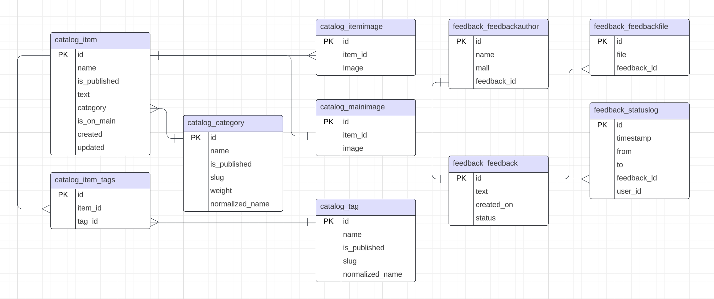

# Lyceum

[](https://gitlab.crja72.ru/django/2024/autumn/course/students/286651-ya.vkarsten-course-1187/-/commits/main)

## Содержание
- [Зависимости](#зависимости)
- [Установка](#установка)
- [Запуск сервера](#запуск-сервера)
- [Локальная разработка](#локальная-разработка)
- [Тестирование](#тестирование)
- [ER-диаграмма](#er-диаграмма)

## Зависимости

- Python 3.9 или выше

## Установка

1. Клонировать репозиторий:
```bash
git clone https://gitlab.crja72.ru/django/2024/autumn/course/students/286651-ya.vkarsten-course-1187 && cd 286651-ya.vkarsten-course-1187
```

2. Создать виртуальное окружение:

- Linux/MacOS
```bash
python3 -m venv venv
```
- Windows
```bash
python -m venv venv
```

3. Активировать виртуальное окружение:

- Linux/MacOS
```bash
source venv/bin/activate
```
- Windows
```bash
venv\Scripts\activate.bat
```

## Запуск

Необходимо выполнить команды из корневой директории проекта:

1. Установить зависимости:
```bash
pip install -r requirements/prod.txt
```

2. Перейти в директорию проекта:
```bash
cd lyceum
```

3. Применить миграции:
```bash
python manage.py migrate
```

4. Собрать статику:
```bash
python manage.py collectstatic
```

5. Скомпилировать локализацию:
```bash
django-admin compilemessages
```

6. Запустить сервер:
```bash
python manage.py runserver
```

## Локальная разработка

Необходимо выполнить команды из корневой директории проекта:

1. Установить зависимости для разработки:
```bash
pip install -r requirements/dev.txt
```

2. Перейти в директорию проекта:
```bash
cd lyceum
```

3. Отредактировать (при необходимости) переменные окружения в файле ```.env.example``` и скопировать их в файл ```.env```:

- Linux/MacOS
```bash
cp .env.example .env
```
- Windows
```bash
copy .env.example .env
```

5. Применить миграции:
```bash
python manage.py migrate
```

4. Загрузить фикстуры базы данных:
```bash
python manage.py loaddata fixtures/data.json
```

Либо же можно воспользоваться демонстрационной БД – для это необходимо скопировать ее из файла:

- Linux/MacOS
```bash
cp demo_db.sqllite3 db.sqllite3
```
- Windows
```bash
copy demo_db.sqllite3 db.sqllite3
```

Для отображения картинок товаров нужно скопировать их в папку ```media```, предварительно создав её:
```bash
mkdir media
```

- Linux/MacOS
```bash
cp -r static_dev/img/catalog/ media/catalog
```
- Windows
```bash
copy -r static_dev/img/catalog/ media/catalog
```

5. Создать суперпользователя для админки:
```bash
python manage.py createsuperuser
```
(следовать инструкциям скрипта)

Если используете демонстрационную БД, можно воспользоваться готовым суперпользователем:
- логин ```admin```
- пароль ```admin```

6. Скомпилировать локализацию:
```bash
django-admin compilemessages
```

7. Запустить сервер:
```bash
python manage.py runserver
```


## Тестирование

Необходимо выполнить команды из корневой директории проекта:

1. Установить зависимости для тестирования:
```bash
pip install -r requirements/test.txt
```

2. Перейти в директорию проекта:
```bash
cd lyceum
```

3. Скомпилировать локализацию:
```bash
django-admin compilemessages
```

4. Запустить тесты:
```bash
python manage.py test
```

## ER-диаграмма

ER-диаграмма базы данных приложения ```Catalog```:


